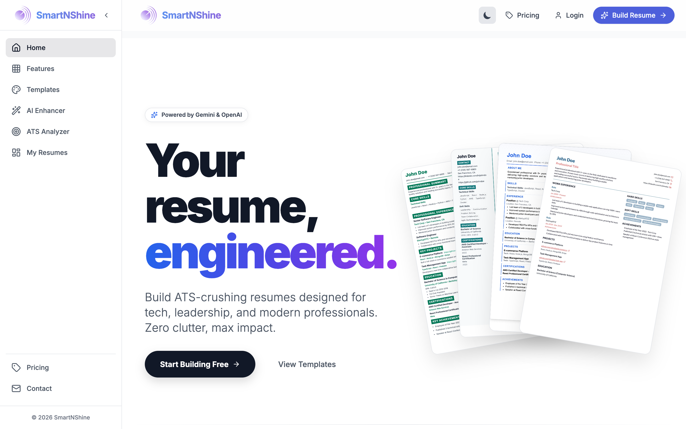
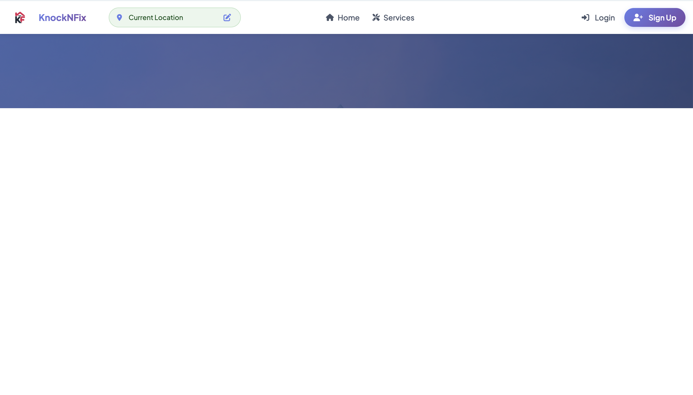
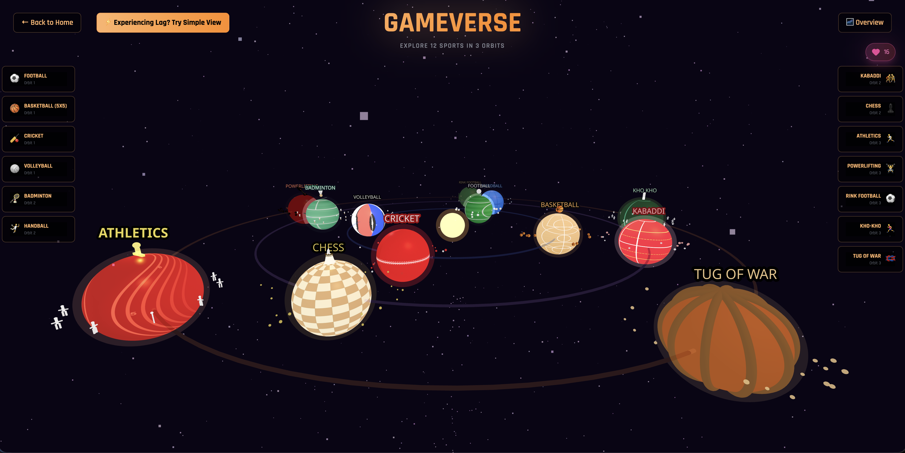
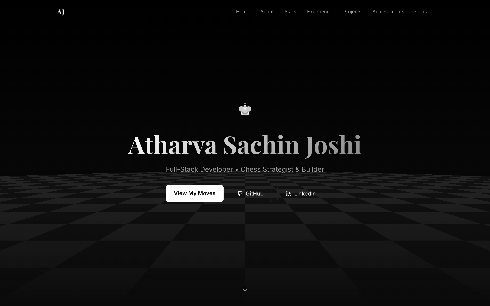

  

  
  
  

  

##  About Me

B.Tech student at **SGGSIET, Nanded** — currently balancing coursework while building startups and production-ready applications. Won a **Shark Tank-style startup competition** and ship real things that people actually use.

---

##  Tech Stack

**Frontend & Backend**  

  

**Tools & Platforms**  

  

---

##  Projects

###  SmartNShine — SaaS Platform
> AI-powered career tools built for everyone, not just students.

| | |
|---|---|
| **Live App** | [smartnshine.app](https://www.smartnshine.app/) |
| **AI Resume Generator** | Live |
| **AI Interview System** | In Progress |

  

 

###  KnockNFix — Local Services Marketplace
> A full-stack marketplace connecting users to verified local service providers.

| | |
|---|---|
| **GitHub** | [atharva038/KnockNFix](https://github.com/atharva038/KnockNFix) |
| **Highlights** | Location-based matching, dual portals, payments with commission logic |
| **Stack** | Node.js · MongoDB · Express · Razorpay · Mapbox |

  

  

 

###  Zenith College Website
> A modern sports & events platform — built to break boring college website norms.

| | |
|---|---|
| **Live** | [zenithsggs.com](https://www.zenithsggs.com/) |
| **Highlights** | Galaxy-themed UI, animations, multiple modules, backend user handling |

  

 

###  Portfolio Web Profile

  

 

<b>More Projects</b>

 

###  College System
> Internal college management tool with election, budget, and admin features.

| | |
|---|---|
| **GitHub** | [atharva038/CollegeSystem](https://github.com/atharva038/CollegeSystem) |
| **Highlights** | Election & candidate management, budget tracking, role-based admin dashboard |

  

---

##  GitHub Stats & Activity

  
  

###  Contribution Graph & Snake Game

  

---

  <code>Next.js</code> &nbsp;•&nbsp; <code>Agentic AI</code> &nbsp;•&nbsp; <code>Cloud Computing</code> &nbsp;•&nbsp; <code>SaaS Scaling</code>
    
  <em>"Build things people actually use."</em>
    
  

